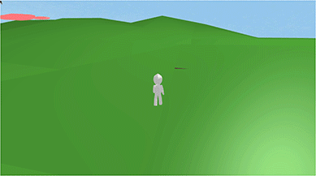
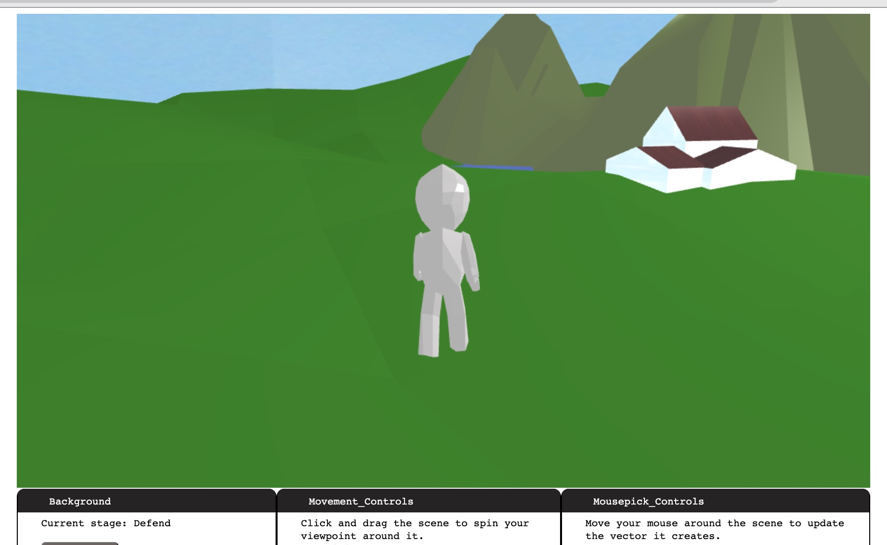

# CS 174A: When Drones Attack!

* Yi Lyu (UID: 405426661)
* Chen Li (UID: 705426669)
* Brian Chap (UID: 405069704)
* Leo Krashanoff (UID: 805133939)

[Link to video](https://drive.google.com/file/d/1YEIfKlGhsWbC1pKLfkKlReeMSL2k0Joj/view?usp=sharing)

## Introduction

It’s the summer of 2020 and you’ve escaped to a house far from the crowds of the city. Safely hidden from view, you relax, thinking there’s nothing to worry about. Then you hear a buzz in the sky and look up. Drones!

For this project, we decided to create a short playable game atop the TinyGraphics Library, where a user attempts to swat invasive drones out from his personal space in efforts of saving their comically small and fragile home.

The structure of the game is simple: for each level N in the game, the player must successfully dislodge N drones (simulated by firing a “drone trap” at the drone). If a drone collides with the house, the game ends, and the player’s score is reset. If all drones are removed, the player advances to the next level. A cutscene plays at the start of each game showing the player’s home being destroyed by a drone. To add a thin veneer of tech to the game, two movement methods were provided to the player. Mouse-driven movement is faster, but more difficult to use, given the tank-style player camera. WASD-based movement, on the other hand, is slower, but more accurate.


## Advanced Features, Extensions to TinyGraphics

### Collision Detection

To detect collisions between the player, their “drone traps”, drones and static objects, a simple collision detection system was implemented, the bulk of which may be found in helpers/collision.js:

```js
const Collision_Helper = collision_helper.Collision_Helper =
    class Collision_Helper {
        // ...
        static has_sphere_collision(points, center, radius, leeway) {
            let res = false;
            for (let point of points) {
                let temp = this.euclidean_distance(point, center);
                if (temp + leeway <= radius) {
                    res = true;
                }
            }
            return res;
        }
 
        static has_square_collision(point, maxx, minx, maxz, minz, leewayx = 0, leewayy = 0) {
            let x = point[0];
            let z = point[2];
            if (x + leewayx < maxx && x - leewayx > minx && z + leewayy < maxz && z - leewayy > minz) {
                return true;
            }
            return false;
        }
    }
```

Each model would be registered to the collision helper on draw, then updated as the Scene persisted. For checking for collision with the home, a box-model was used. For checking for collision with drone models, a sphere-model was used. The fewer the models, the more streamlined the comparisons, the more smoothly the Scene ran.

### Mouse Picking

A primary feature used in the game was mouse picking for mouse-driven motion of the
player model. An initial implementation of this feature was made with the addition of the [`Mousepick_Controls` subclass](helpers/mousepick.js) by appending an empty secondary scene to the controls of the primary in the same way `Movement_Controls` was.

This secondary Scene object would track the user’s mouse position by using the inverse of the primary Scene’s world-to-image plane transformations. The class would then pass it to the primary Scene as a vector in world space. The primary scene would then use this vector to form a line, and test the line for intersections in the world.

### Model "Gluing"

Though not explicitly listed as an advanced feature, a significant extension made to the TinyGraphics cradle was the ability to “glue” actors to a surface. This way, the player’s model could navigate our uneven island terrain with ease:



Since there was realistically only one model that our playermodel needed to be glued to, we saved some code by registering only our island as “gluable”. However, since our island was a custom object as created in Blender, we needed to register vertices via TinyGraphics’ engine. To do this, we registered the shape’s `arrays.position`:

```js
        this.island_vertex = this.shapes.island.arrays.position.map(x => [x[0]*this.island_scale, x[1]*this.island_scale, x[2]*this.island_scale])
        let surface_indices = this.shapes.island.indices;
        this.surfaces = []
        for (let i= 0; i < 979; i+=3) {
            this.surfaces.push([this.island_vertex[surface_indices[i]],
                this.island_vertex[surface_indices[i + 1]],
                this.island_vertex[surface_indices[i + 2]]]);
        }
        this.surfaces = this.surfaces.filter(x => x[0][1] > 0 && x[1][1] > 0 && x[2][1] > 0);
```

Then, to find the surface directly beneath some coordinates in the XZ-plane:

```js
// Then, to find whether some object is above a surface:    
find_Surface(surfaces, x, z) {
        if (surfaces) {
            for (let i = 0; i < 230; i++) {
                let surface = surfaces[i];
                if (this.Is_Inside(surface[0][0], surface[0][2],
                    surface[1][0], surface[1][2],
                    surface[2][0], surface[2][2], x, z)) {
                        return surface;
                    }
            }
        }
        // Bug if you can't find one
        return [[-1, -1, -1], [-1, -1, -1], [-1, -1, -1]]; //indicate error
    }
```

With this, the player model could move across the island's uneven geometry with ease.

### Custom Modeling

One of the members of our group, Chen, had significant experience working in Blender before, and created a set of unique object files for the game. Specifically, the entirety of the island scene you see in our game was created by them.


Another custom model created for the game was the player character:



All other models in the game were created as composites by the team.

## References

* For mouse picking, code provided in both discussion and in [WebGLFundamentals](https://webglfundamentals.org/webgl/lessons/webgl-picking.html) was referenced.
* And, of course, the CS 174A slide decks.

## Project Setup Procedure

Since the project is built on the same starter template code as Assignment 0, the project
runs after unzipping with the provided `server.py`.
