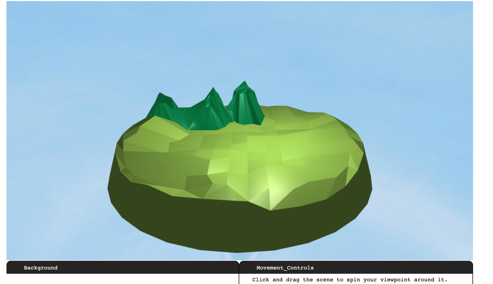

<!--Annotations for Pandoc markdown, if used
% CS174A Final Project
% Terzopoulos W21
% 20 Match 2021
-->

# CS174A Final Project

* Yi Lyu (UID: TODO)
* Chen Li (UID: TODO)
* Brian Chap (UID: TODO)
* Leo Krashanoff (UID: 805133939)

# Introduction

A short introduction of your design and implementation

For this, project, we decided to create a short playable game atop the TinyGraphics
library.

# Advanced Features, Extensions to TinyGraphics

Three key advanced features were incorporated into this project, among a number of
other features such as custom modeling.

## Simulation

For the introduction to our game, we built on the inertial objects demo
code provided in [the examples folder](examples/collisions-demo.js) to create a
scripted "cutscene" of an alien attacking the player's home.

...

## Mouse Picking

Another primary feature used in the game was mouse picking for mouse-driven motion of the
player model. An initial implementation of this feature was made with the addition of the
[`Mousepick_Controls` subclass](examples/common.js:1015) by appending an empty secondary scene
to the controls of the primary in the same way `Movement_Controls` was.

...

## Collision Detection

To detect player collisions with aliens and static objects, a simple collision detection system
was implemented:

```js
// TODO
```

For checking for collision with the home, a box-model was used. For checking for collision with
alien models, a sphere-model was used.

...

## Model "Gluing"

To keep moving actors in the scene "glued" to the island, a cradle for finding the nearest
object intersection was created:

```js
// TODO
```

With this, models could move across the island's uneven geometry with ease.

...

## Custom Modeling

Though not listed explicitly in the advanced features list, one of the members of our
group, Chen, had experience working in Blender before, and created a set of unique object
files for the game. Specifically, the entirety of the island scene you see in our game
was created by them.



# References

* For mouse picking, code provided in both discussion and in [WebGLFundamentals](https://webglfundamentals.org/webgl/lessons/webgl-picking.html)
  was referenced.

# Project Setup Procedure

Since the project is built on the same starter template code as Assignment 0, the project
runs after unzipping with the provided `server.py`.
